# 本科毕业设计-网络扫描器的设计与实现

## 运行环境

- 操作系统：Windows XP及以上。

- 开发工具：Microsoft Visual C++6.0，Notepad++。

- 开发语言：C/C++， MFC。 

## 主要功能模块测试

### 主机扫描功能模块测试

在主机扫描功能模块中，管理员输入起始 IP 为 192.168.0.100，结束 IP 为 192.168.0.103，在这个 IP 段的范围内进行测试，结果显示有两台主机处在存活状态，分别是 192.168.0.100 和 192.168.0.102，其扫描结果如图所示：

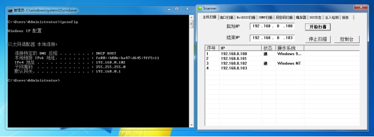

### 端口扫描功能模块测试

在端口扫描功能模块中，管理员输入起始 IP 为 192.168.0.100，结束 IP 为 192.168.0.102，在这个 IP 段的范围内进行测试，端口范围设置为 1~1024，结果显示，主机 192.168.0.100 开放了 80 端口，192.168.0.102 开放了 135、139 和 445 端口，其扫描结果如图所示：

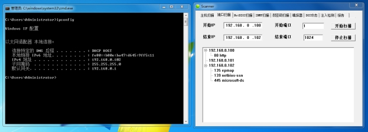

### NetBIOS 扫描功能模块测试

在网上基本输入输出系统 NetBIOS 扫描模块中，管理员选择 192.168.0.102 主机作为当前的目标主机，该主机为当前的主机 IP，显示出的结果与实际相符，其扫描结果如图所示：

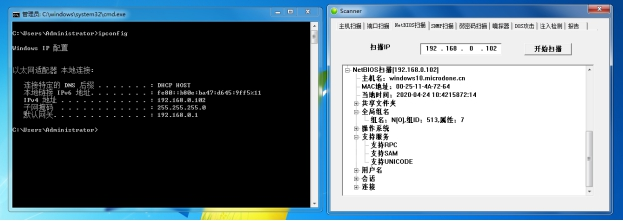

### SNMP 扫描功能模块测试

在简单网络管理协议 SNMP 扫描功能模块中，管理员选择 192.168.0.102 主机作为当前的目标主机，该主机为当前的主机 IP，显示出的结果与实际相符，其扫描结果如图所示：

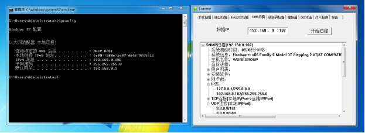

### 弱密码扫描功能模块测试

在弱密码扫描功能模块中，管理员选择 192.168.0.102 主机作为当前的目标主机，该主机为当前的主机 IP，用户名设置为 test，密码采用字典文件的方式去枚举，通过扫描出来的结果进行验证，可以确定该结果与实际相符，其扫描结果如图所示：

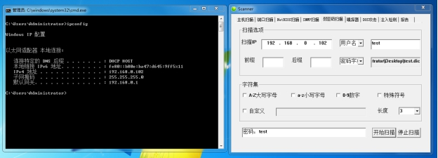

### 嗅探器扫描功能模块测试

在嗅探器扫描功能模块中，管理员添加 Pass、Password、pwd 三个关键字对本机进行监听，然后通过由服务器搭建的一个登陆提交表单的页面去提交用户名和密码，结果成功拦截到了响应的数据包，根据数据包内容，管理员可以判断该结果与实际相符合，其扫描结果如图所示：

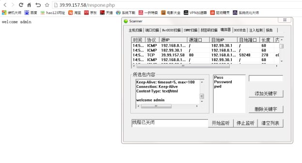

### DOS 攻击功能模块测试

在DOS攻击功能模块中，管理员启动 2048 个线程对目标 IP 为 39.99.157.58 的 80 端口进行连接，然后再尝试访问网站，结果发现网站宕机，管理员可以判断该结果与预期相符合，其扫描结果如图所示：

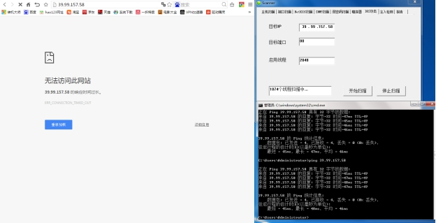

### 注入检测功能模块测试

在注入检测功能模块中，为了测试结果，我尝试在服务器上搭建了一个简易的测试 Demo，网站由两部分构成，一个是登录页面 login.html，一个是验证是否登录成功的页面 respone.php，登录页面如图所示：

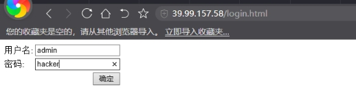

如果以 welcome+ 用户名的形式返回则说明登录成功，登录成功的页面如图所示：

如果登陆失败会返回“The username or password is wrong!”，登录失败的页面如图所示：

login.html 源代码如图所示：

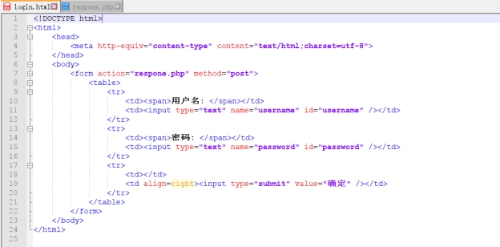

respone.php 源代码如图所示：

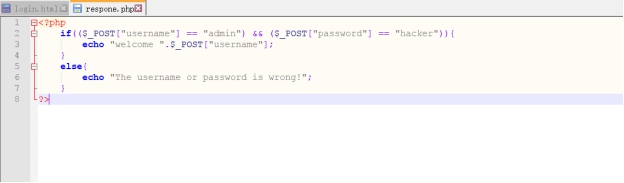

管理员根据以上测试分析可以得出结论，如果管理员把 welcome 一词当做注入漏洞的标志，若登录成功出现 welcome 一词，则说明网站存在注入漏洞，其结果如图所示：

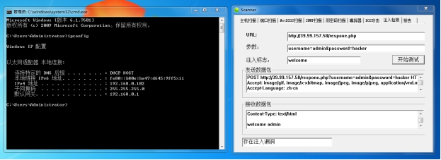

### 报告生成功能模块测试

在报告生成功能模块中，管理员输入目标 IP 地址，然后尝试打印部分功能扫描出来的结果，以HTML的形式生成，可以看出该结果与预期相符合，其结果如图所示：

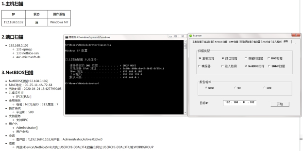

## 未来展望

本文所设计的网络扫描器由于时间和实验条件的限制，该网络扫描器还存在需要进一步改进的地方，主要表现在：

- 该网络扫描器只能在 Windows 平台下运行，不支持 macOS、Unix、Linux 等其它主流操作系统。

- 该网络扫描器的兼容性太差，在 32 位的环境下和 64 位的环境下运行结果会不太一样，需要进一步的去完善。

- 网络扫描器的多线程实现过于简单，无法很好地处理线程间的关系，常常会因为卡顿而导致程序崩溃，需要进一步的去调整。

- 网络扫描器接收到的数据只有英文字符不会乱码，中文字符会乱码，编码转换问题没有做好，也有待去改进和完善。

- 网络扫描器目前报告只能打印 HTML 的形式，没有办法支持多种报告格式，希望能进一步的扩充其功能内容。